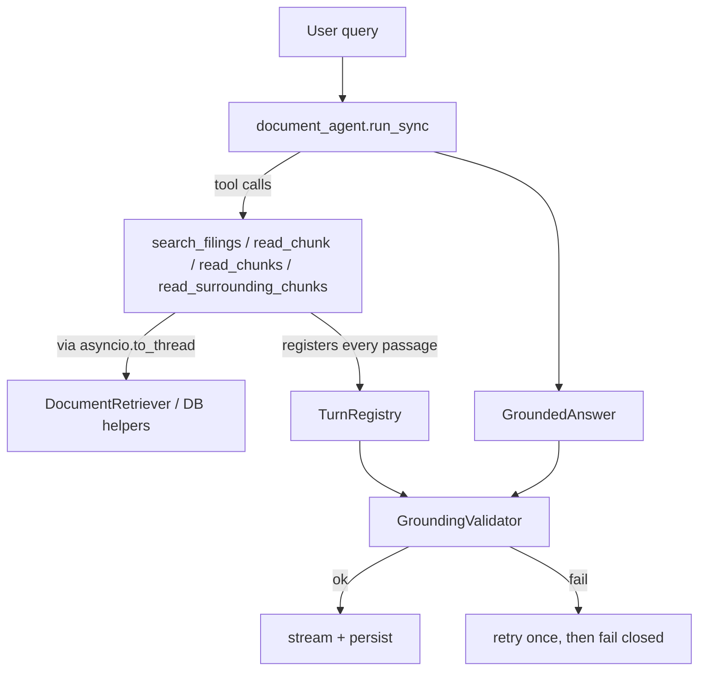

# Assistant

The PydanticAI agent that turns a retrieved-passage corpus into a grounded, cited answer. Retrieval
(Phase 5) and grounding validation (`app/grounding/`) stay independent of PydanticAI — this module is
the only place that imports it. `chat/orchestrator.py` is the sole caller of `run_document_agent`.

## Pipeline



### Why a `TurnRegistry`

An agent could, in principle, cite a `chunk_id` it never actually retrieved (a hallucinated ID, or one
copied from training data). The `TurnRegistry` records every passage returned by every tool call during
the turn — the grounding validator only accepts citations whose `chunk_id` is in that registry. This is
what makes "cite only what you retrieved" enforceable rather than just requested in the prompt.

### Why tools return strings, not objects

Tool functions return `format_passages_for_agent(...)` output (bounded, grep-style text) rather than
raw `RetrievedPassage` objects. The model only ever sees text; structured citation data is reconstructed
afterward from the `TurnRegistry`, keyed by the `chunk_id` the model chose to reference.

## How grounding works (`app/grounding/validator.py`)

Structural citation shape and factual support are checked separately — a citation can be shaped
correctly and still be wrong, so both gates have to pass. `GroundingValidator.validate(answer, registry)`
runs, in order, failing closed (returning `ValidationResult(ok=False, error=...)`) at the first problem:

1. **Empty answer** → fail.
2. **`insufficient_evidence=True`** → must carry zero citations (a refusal can't also cite something);
   if so, passes immediately without running the remaining checks.
3. **Structural checks** on the citation list: at least one citation present; `citation_index` values
   unique, 1-based, and contiguous (`[1, 2, 3]`, never `[1, 3]` or `[1, 1]`); every `[n]` marker in the
   answer text matches the citation index set exactly (no marker without a citation, no citation never
   referenced); every cited `chunk_id` exists in the turn's `TurnRegistry` — this is the check that makes
   it impossible to cite a chunk the agent never actually retrieved this turn.
4. **LLM grounding judge** (`OpenAIGroundingJudge`, model = `openai_grounding_model`): for every
   citation, sends `{citation_index, answer, excerpt, source_text}` to a small model and asks it to
   decide `supported: bool` — does the cited chunk's full text actually support the claim the excerpt is
   attached to? All citations are judged in **one batched call** (not one call per citation); if the
   judge's returned indexes don't line up with the cases sent (a model quirk under load), the validator
   retries case-by-case (`_judge_with_index_repair`) rather than failing outright. Any `supported=False`,
   or any exception from the judge call itself (timeout, malformed output), fails the whole turn — there
   is no partial-credit path.

`prune_unreferenced_citations(answer)` runs *before* validation and drops any citation whose index never
appears as an `[n]` marker in the answer text — models sometimes list a citation the final answer text
doesn't actually reference; pruning it first avoids a spurious "markers must match citations" failure.

**Fail-closed retry** lives one layer up, in `chat/orchestrator.py`: if validation fails on the first
agent run, the orchestrator retries once more with a **completely fresh** `TurnRegistry` and
`DocumentAgentDeps` (`MAX_VALIDATION_ATTEMPTS = 2`). If the second attempt also fails, the turn streams a
"could not fully verify" error and persists nothing — never a silently-ungrounded answer.

## Settings (`app/config.py`)

| Setting | Default | Role |
| --- | --- | --- |
| `openai_chat_model` | `"gpt-5.5"` | PydanticAI model string (`openai:{model}`) |
| `openai_agent_request_limit` | `20` | `UsageLimits(request_limit=...)` — hard cap on tool-call rounds per turn |
| `openai_agent_temperature` | `0.0` | Deterministic analyst answers |
| `openai_grounding_model` | `"gpt-4.1-mini"` | Small model used only by the grounding judge (see `app/grounding/`) |

## Module map

| File | Responsibility |
| --- | --- |
| `agent.py` | Builds the `Agent[DocumentAgentDeps, GroundedAnswer]` singleton; `run_document_agent()` is the sync entry point |
| `deps.py` | `DocumentAgentDeps` (retriever, registry, thread/user ids, status callback) + `TurnRegistry` |
| `tools.py` | Four bounded tools wrapping Phase 5 retrieval + `app/database/documents.py` helpers |
| `outputs.py` | `Citation` / `GroundedAnswer` structured output types |
| `instructions.md` | The product contract, loaded as plain text at import time |
| `status.py` / `progress.py` | Map tool/agent lifecycle to analyst-facing status strings; `progress.py` is a debug-only listener registry used by the smoke script |

## Quick smoke test

From `backend/`:

```bash
uv run python scripts/smoke_assistant.py
```

Edit `QUERY_KEY` at the top of the script to pick which question from `QUERIES` runs. As it runs, it
prints timestamped, flushed progress lines (agent start/finish with request/tool-call/token counts, each
tool's start/finish with duration and result count, then the grounding validation result) so a slow turn
(30s-10min+ depending on how many tool rounds the agent needs) doesn't look hung.

**In Jupyter:** call `setup_progress_logging()` once, then call `run_document_agent(query, deps)`
directly in a cell — the cell prints live progress as the agent runs instead of sitting silent. The
script also applies `nest_asyncio` at import time, which is required because
`asyncio.run(GroundingValidator().validate(...))` would otherwise raise
`RuntimeError: asyncio.run() cannot be called from a running event loop` inside a Jupyter kernel (Jupyter
already runs its own event loop).
