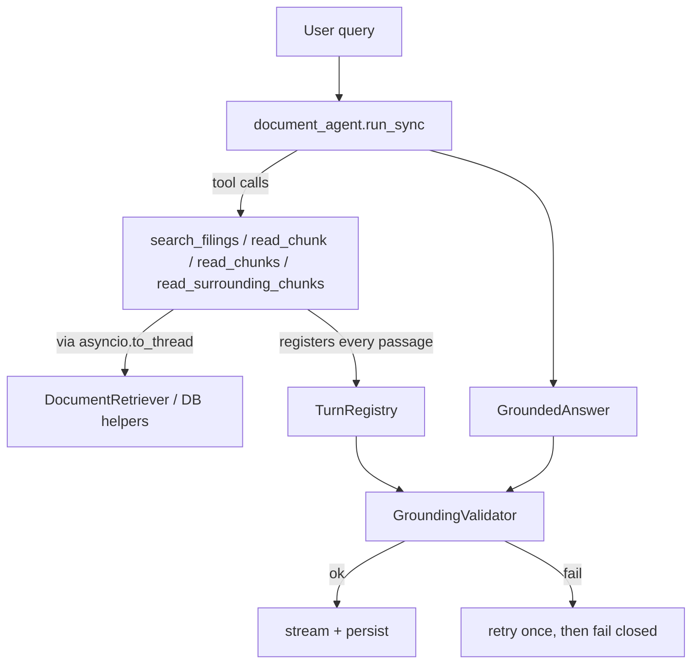

# Assistant

The PydanticAI agent that turns a retrieved-passage corpus into a grounded, cited answer. Retrieval
(Phase 5) and grounding validation (`app/grounding/`) stay independent of PydanticAI — this module is
the only place that imports it. `chat/orchestrator.py` is the sole caller of `run_document_agent`.

## Pipeline



### Why a `TurnRegistry`

An agent could, in principle, cite a `chunk_id` it never actually retrieved (a hallucinated ID, or one
copied from training data). The `TurnRegistry` records every passage returned by every tool call during
the turn — the grounding validator only accepts citations whose `chunk_id` is in that registry. This is
what makes "cite only what you retrieved" enforceable rather than just requested in the prompt.

### Why tools return strings, not objects

Tool functions return `format_passages_for_agent(...)` output (bounded, grep-style text) rather than
raw `RetrievedPassage` objects. The model only ever sees text; structured citation data is reconstructed
afterward from the `TurnRegistry`, keyed by the `chunk_id` the model chose to reference.

## Settings (`app/config.py`)

| Setting | Default | Role |
| --- | --- | --- |
| `openai_chat_model` | `"gpt-5.5"` | PydanticAI model string (`openai:{model}`) |
| `openai_agent_request_limit` | `20` | `UsageLimits(request_limit=...)` — hard cap on tool-call rounds per turn |
| `openai_agent_temperature` | `0.0` | Deterministic analyst answers |
| `openai_grounding_model` | `"gpt-4.1-mini"` | Small model used only by the grounding judge (see `app/grounding/`) |

## Module map

| File | Responsibility |
| --- | --- |
| `agent.py` | Builds the `Agent[DocumentAgentDeps, GroundedAnswer]` singleton; `run_document_agent()` is the sync entry point |
| `deps.py` | `DocumentAgentDeps` (retriever, registry, thread/user ids, status callback) + `TurnRegistry` |
| `tools.py` | Four bounded tools wrapping Phase 5 retrieval + `app/database/documents.py` helpers |
| `outputs.py` | `Citation` / `GroundedAnswer` structured output types |
| `instructions.md` | The product contract, loaded as plain text at import time |
| `status.py` / `progress.py` | Map tool/agent lifecycle to analyst-facing status strings; `progress.py` is a debug-only listener registry used by the smoke script |

## Quick smoke test

From `backend/`:

```bash
uv run python scripts/smoke_assistant.py
```

Edit the `QUERIES` list at the top of the script to try different questions against the real corpus.
