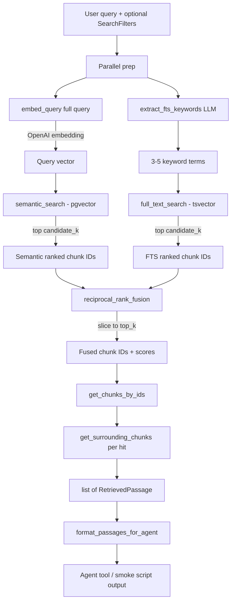

# Retrieval

Hybrid search over SEC filing chunks stored in Supabase Postgres. Each query runs **semantic**
(pgvector) and **keyword** (Postgres full-text) search in parallel, fuses the two ranked lists with
**Reciprocal Rank Fusion (RRF)**, then hydrates the top hits with document metadata and optional
neighboring chunks for context. This module stays independent of PydanticAI — Phase 6 wraps
`DocumentRetriever.search()` as an agent tool; nothing here imports or knows about agents.

## Pipeline



### Step-by-step

1. **Parallel prep** — `embed_query` embeds the **full** user question with `text-embedding-3-small`
   for semantic search. At the same time, `keywords.extract_fts_keywords` distills the query down to
   3-5 keyword terms for full-text search. Both are OpenAI API calls, so `_search_with_session` runs
   them concurrently in a `ThreadPoolExecutor` rather than one after another — this is the same pattern
   as the dual search step below, just one level up.

   **Why keyword extraction exists:** `full_text_search` runs Postgres `plainto_tsquery`, which ANDs
   every non-stopword together — a chunk must contain *all* of them to match at all. A natural-language
   question like "How did NVIDIA describe demand drivers for its Data Center business from fiscal 2021
   through fiscal 2025?" has 10+ content words after stopword removal; requiring a single chunk to
   contain every one of them returns **zero** rows in practice (verified against the real corpus — see
   below). `extract_fts_keywords` fixes this by asking a small model (`retrieval_fts_keyword_model`,
   default `gpt-4.1-mini`) for 3-5 salient domain terms (e.g. `"Data Center fiscal 2021 2025"`), merges
   in any capitalized product names and known two-word SEC phrases found in the raw query, and falls
   back to a deterministic regex-based extraction if the LLM call fails or returns too few usable terms.
   Short, already-keyword-like queries (≤ `retrieval_fts_keyword_fast_path_tokens` words) skip the LLM
   call entirely and pass straight through.

2. **Dual search (parallel)** — `retriever._dual_search` runs semantic and full-text queries
   concurrently in a `ThreadPoolExecutor`, each on its own DB session. Semantic search orders by
   pgvector cosine distance (`<=>`); score is `1 - distance`. Full-text search runs `plainto_tsquery`
   with the **extracted keywords** (not the raw query) against the ingest-generated `search_vector`
   column and ranks with `ts_rank_cd`. Both return up to `candidate_k` hits.

3. **Fusion** — `fusion.reciprocal_rank_fusion` merges the two chunk-ID rankings. Each appearance at
   rank `r` (1-based) adds `1 / (k + r)` to that chunk's score — ranks are combined, not raw scores,
   since cosine similarity (bounded `[0, 1]`) and `ts_rank_cd` (unbounded) aren't comparable on the same
   scale. Results are sorted by total score descending and truncated to `top_k`.

4. **Hydrate** — `retriever.DocumentRetriever` loads full chunk rows (with parent document) for the
   fused IDs via `app.database.documents.get_chunks_by_ids`, preserving fusion order.

5. **Neighbors** — when `include_neighbors=True` (default), each hit fetches adjacent chunks within
   `retrieval_neighbor_radius` indices in the same document via `get_surrounding_chunks`. Neighbors are
   attached to the parent passage with `fusion_score=0.0` and deduplicated against chunks already in
   the top-`k` fused set.

6. **Format** — `types.format_passages_for_agent` turns passages into bounded, grep-style text, ready
   for a future PydanticAI tool response (see the output-formatting limits below).

There is deliberately **no reranker** in this pipeline (no Cohere, no cross-encoder, no new
dependency) — the project's retrieval design only calls for vector search, full-text search, and RRF
fusion.

## Default settings

All retrieval tuning lives in `app/config.py` and can be overridden via environment variable of the
same name (e.g. `RETRIEVAL_TOP_K=15`).

| Setting | Default | Role |
| --- | --- | --- |
| `retrieval_candidate_k` | `50` | Max hits fetched from **each** search path before fusion |
| `retrieval_top_k` | `10` | Final number of fused passages returned |
| `retrieval_rrf_k` | `60` | RRF constant `k` in `1 / (k + rank)` |
| `retrieval_neighbor_radius` | `1` | Chunks before/after each hit to include (same document, by `chunk_index`) |
| `retrieval_fts_config` | `"english"` | Postgres text search config for `plainto_tsquery` |
| `retrieval_fts_keyword_model` | `"gpt-4.1-mini"` | Small model for FTS keyword extraction |
| `retrieval_fts_keyword_min` | `3` | Minimum extracted FTS terms before falling back to the deterministic extractor |
| `retrieval_fts_keyword_max` | `5` | Maximum extracted FTS terms (`plainto_tsquery` ANDs every word) |
| `retrieval_fts_keyword_fast_path_tokens` | `5` | Skip the keyword-extraction LLM call when the query is already this short |
| `openai_embedding_model` | `"text-embedding-3-small"` | Model used for live query embeddings |
| `openai_embedding_dimensions` | `1536` | Embedding width; must match ingested chunk vectors |

### `DocumentRetriever.search` parameters

| Parameter | Default | Role |
| --- | --- | --- |
| `filters` | `None` | Optional `SearchFilters` (see below) |
| `top_k` | `settings.retrieval_top_k` | Override fused result count |
| `candidate_k` | `settings.retrieval_candidate_k` | Override per-path candidate pool |
| `include_neighbors` | `True` | Attach surrounding chunks to each hit |
| `session` | auto | Pass a SQLAlchemy session or let the retriever open one |

### Output formatting limits (`types.py`)

| Constant | Value | Role |
| --- | --- | --- |
| `MAX_PASSAGE_EXCERPT_CHARS` | `800` | Max characters per passage (or neighbor) in agent output |
| `MAX_AGENT_OUTPUT_CHARS` | `12_000` | Max total characters from `format_passages_for_agent` |

## Search filters

`SearchFilters` optionally narrows both semantic and full-text queries:

| Field | Type | SQL effect |
| --- | --- | --- |
| `ticker` | `str \| None` | `sd.ticker = :ticker` |
| `fiscal_years` | `list[int] \| None` | `sd.fiscal_year = ANY(:fiscal_years)` |
| `form` | `str \| None` | `sd.form = :form` |

Unset fields apply no filter. Filters are ANDed together.

## Module map

| File | Responsibility |
| --- | --- |
| `retriever.py` | `DocumentRetriever` orchestrator: embed → search → fuse → hydrate → neighbors |
| `embeddings.py` | Single-query OpenAI embedding for live retrieval (separate from `ingest/embeddings.py`'s batch helper) |
| `keywords.py` | LLM keyword extraction for full-text search (`extract_fts_keywords`) |
| `queries.py` | pgvector semantic search + Postgres full-text search SQL |
| `fusion.py` | Reciprocal Rank Fusion |
| `types.py` | `SearchFilters`, `RetrievedPassage`, agent formatting helpers |

## Verified against the real corpus

Before adding `keywords.py`, `full_text_search` ran `plainto_tsquery` on the raw question. Tested
directly against the ingested corpus, every natural-language question below returned **zero** rows —
`plainto_tsquery` ANDs every content word, and a real question rarely has all of them in one chunk:

| Query (raw, no extraction) | FTS hits |
| --- | --- |
| "Across Apple's 2021-2025 10-Ks, how did the revenue mix between iPhone, Services, Mac, iPad, and Wearables change?" | 0 |
| "How did NVIDIA describe demand drivers for its Data Center business from fiscal 2021 through fiscal 2025?" | 0 |
| "What did management say about operating margins and cost structure across recent fiscal years?" | 0 |
| "Did generative AI improve gross margins for any of these companies?" | 0 |

Same queries, same corpus, after `extract_fts_keywords`:

| Extracted keywords | FTS hits |
| --- | --- |
| `"iPhone Services Mac iPad Wearables"` | 10 |
| `"Data Center fiscal 2021 2025"` | 4 |
| `"operating margins cost structure fiscal"` | 2 |
| `"generative AI gross margins"` | 7 |

This is why keyword extraction exists rather than passing the query through unchanged — hybrid search's
full-text leg was silently contributing nothing before this change (RRF still worked because semantic
search alone was carrying every result).

## Quick smoke test

From `backend/`:

```bash
uv run python -m scripts.smoke_retrieval
```

The script runs a handful of ticker-scoped 10-K questions through `DocumentRetriever` and prints
`format_passages_for_agent` output against the real ingested corpus.

## Usage

```python
from app.retrieval import DocumentRetriever, SearchFilters
from app.retrieval.types import format_passages_for_agent

retriever = DocumentRetriever()
passages = retriever.search(
    "What was Apple's total net sales in fiscal 2024?",
    filters=SearchFilters(ticker="AAPL", form="10-K"),
)
print(format_passages_for_agent(passages))
```

## RRF in brief

Given rankings `[semantic_ids, fts_ids]` and constant `k`:

```
score(chunk) = Σ  1 / (k + rank_in_list)
```

A chunk that ranks well in **both** lists accumulates a higher score than a chunk that only appears in
one. Default `k=60` follows the common RRF literature value and dampens the influence of top ranks vs.
lower ranks.
