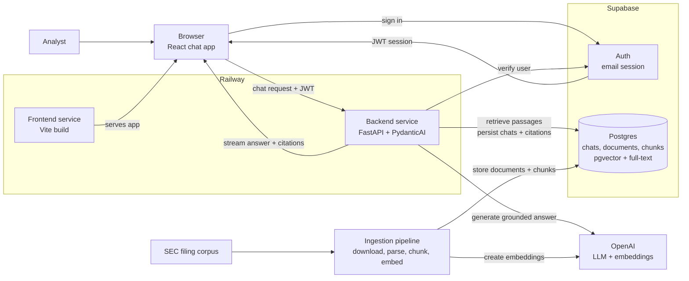

# Document Copilot Architecture

## Purpose

Document Copilot is an internal research assistant for analysts who need grounded answers from a curated SEC filing corpus. The architecture must optimize for trust: every answer is generated from retrieved source passages, every factual claim is citable, and the system fails clearly when the corpus does not support an answer.

## High-Level Architecture



## Architectural Goals

- Keep the browser thin: it renders chat state, manages the user's Supabase session, and streams assistant responses.
- Keep the backend authoritative: retrieval, grounding, citation checks, tool execution, and database writes happen in FastAPI.
- Use Supabase for identity and durable product state.
- Use Supabase `pgvector` for semantic retrieval and Postgres full-text search for keyword retrieval.
- Make the LLM path typed and testable by using PydanticAI agents with explicit dependencies, outputs, and tool boundaries.

## Stack

Frontend: Vite + React SPA + TypeScript, React Router, Tailwind CSS, shadcn/ui, `@supabase/supabase-js`, Vercel AI SDK UI packages.

Backend: Python 3.12+, FastAPI + Uvicorn, Pydantic v2 + pydantic-settings, PydanticAI, OpenAI SDK, Supabase Python client, SQLAlchemy + Alembic, pgvector, `httpx`, `structlog`.

Persistence: Supabase Auth, Supabase Postgres.

## Request Flow

1. User signs in with Supabase email auth in the React SPA.
2. Frontend stores the Supabase session through `@supabase/supabase-js`.
3. When user opens a chat, frontend loads thread and prior messages through FastAPI.
4. Chat UI uses the Vercel AI SDK React primitives to manage message state.
5. Frontend sends the Supabase access token as `Authorization: Bearer <token>`.
6. FastAPI verifies the token with Supabase Auth before doing any retrieval or LLM work.
7. FastAPI creates a request-scoped context containing the authenticated user, chat thread, retrieval service, citation policy, and LLM settings.
8. A PydanticAI agent retrieves relevant document chunks, generates a grounded answer, and returns typed output containing answer text and citations.
9. FastAPI streams assistant message parts back to the browser.
10. FastAPI persists the final user message, assistant message, cited chunks, and usage metadata to Supabase.

## Backend Module Layout

```text
backend/app/
├── api/
│   └── chat.py                 # FastAPI routes for chat threads and streaming
├── auth/
│   └── dependencies.py         # Supabase JWT verification and current user dependency
├── chat/
│   ├── orchestrator.py         # Coordinates one chat turn end-to-end
│   ├── messages.py             # Converts AI SDK messages to/from internal types
│   └── streaming.py            # Emits AI SDK-compatible streaming events
├── assistant/
│   ├── agent.py                # PydanticAI agent definition
│   ├── deps.py                 # Runtime dependency dataclass for the agent
│   ├── outputs.py              # GroundedAnswer, Citation, SourcePassage
│   └── instructions.md         # System instructions and product contract
├── retrieval/
│   ├── queries.py              # pgvector and full-text SQL queries
│   ├── fusion.py               # Reciprocal Rank Fusion for hybrid search
│   └── retriever.py            # Query-to-source-passage retrieval logic
├── grounding/
│   └── validator.py            # Ensures citations map to retrieved passages
└── database/
    ├── supabase.py             # Supabase client construction
    ├── models.py               # SQLAlchemy table models used by Alembic autogenerate
    ├── chats.py                # Chat, thread, message, and citation persistence
    └── documents.py            # Source document, chunk, embedding, and search queries
```

## Retrieval Strategy

Document Copilot uses hybrid retrieval:

1. Embed the user's query with the configured OpenAI embedding model.
2. Run a semantic search over `document_chunks.embedding` with `pgvector`.
3. Run a lexical search over `document_chunks.search_vector` with Postgres full-text search.
4. Fuse the two ranked lists in Python with Reciprocal Rank Fusion (RRF).
5. Fetch the selected chunks, source document metadata, and optional neighboring chunks for grounding.

## Data Model

- `profiles` — one row per authenticated user.
- `chat_threads` — thread metadata, owner, title, timestamps.
- `chat_messages` — user and assistant messages in order.
- `message_citations` — normalized citation records linked to assistant messages.
- `source_documents` — original document records with filing metadata and normalized Markdown content.
- `document_chunks` — chunk text, embeddings, full-text search vectors, token count, metadata JSON.

## Grounding and Citation Policy

- Every assistant answer has at least one citation unless the answer explicitly says there is not enough evidence.
- Every citation maps to a retrieved source passage.
- Cited passages include company, filing, date, page/section, and excerpt.
- The model cannot cite documents that were not retrieved for the current request.
- If citation validation fails, the backend returns a controlled failure.

## Streaming Contract

```text
POST /chat/stream
Authorization: Bearer <supabase_access_token>
Content-Type: application/json
```

Request body:
```json
{ "threadId": "uuid", "messages": [] }
```

## Deployment Shape

Railway runs two services:
- Frontend: static Vite build served as a web app.
- Backend: FastAPI service running Uvicorn.

Supabase remains hosted and stores all durable retrieval data. The Railway backend stays stateless.

## Implementation Sequence

1. Scaffold frontend SPA and backend FastAPI app.
2. Add SQLAlchemy models and Alembic migration setup.
3. Add initial Alembic migration (pgvector, source documents, chunks, full-text, chat, citations).
4. Add Supabase Auth in frontend and token verification in FastAPI.
5. Add shared frontend API client with automatic bearer-token injection.
6. Add chat streaming endpoint with stubbed assistant response.
7. Add AI SDK chat UI on frontend pointed at FastAPI.
8. Add Markdown ingestion, chunking, embeddings, and Supabase writes.
9. Add semantic search with pgvector.
10. Add Postgres full-text search and Python RRF fusion.
11. Add PydanticAI document agent with typed dependencies and typed answer output.
12. Add citation validation and grounding enforcement.
13. Add final UI for citations, source passages, empty states, and errors.
